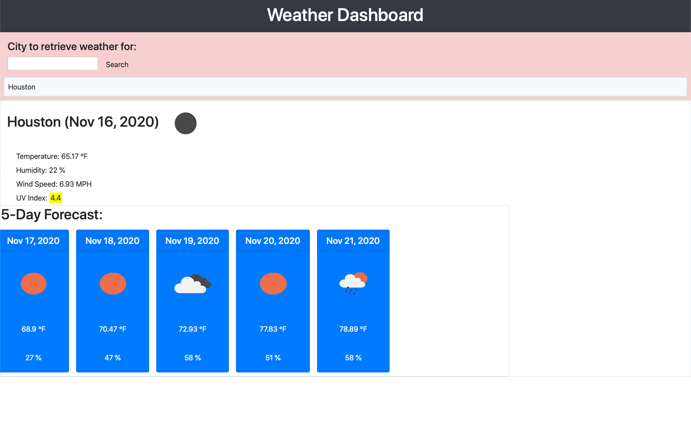

# weatherDashboard

A simple, easy to use weather tool.  Allows a user to enter a city name, and the app retrieves the current weather and the five day forecast from OpenWeatherMap.org for the input city.  

![url]https://chefjaypeek.github.io/weatherDashboard/index.html

